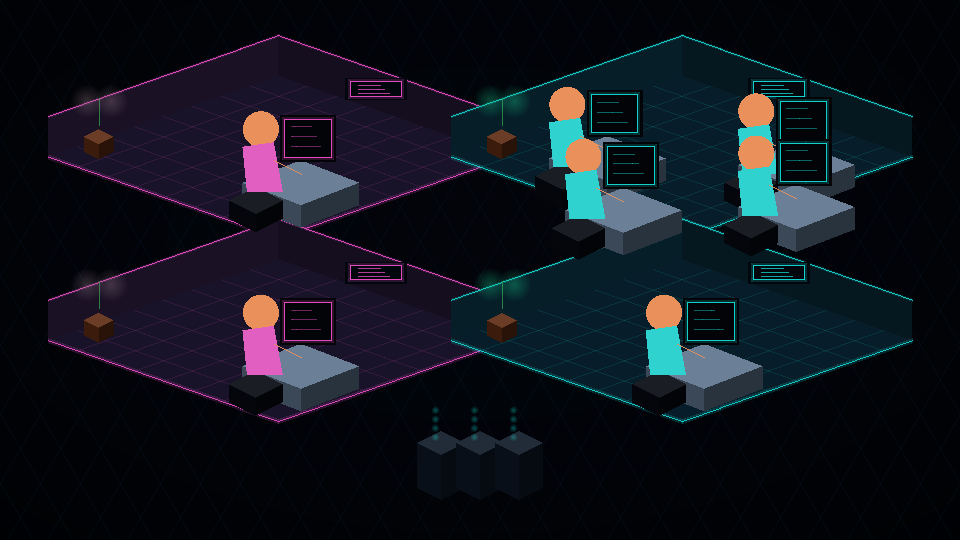

# Codex Operations Center

An open-source, real-time operations center for Codex sessions across local projects.

The project combines truthful Codex lifecycle observability with a live isometric operations complex: projects become rooms, sessions become operators at real workstations, and the selected session opens a detailed inspector. It does not invent agent personalities, progress percentages, or performance scores.



## Install

Linux and macOS:

```bash
curl --proto '=https' --tlsv1.2 -fsSL \
  https://raw.githubusercontent.com/Brobicho/codex-operations-center/main/install.sh | sh
```

The installer downloads the matching release artifact, verifies its SHA-256 checksum, installs without `sudo`, and registers the global Codex lifecycle integration. On Linux it also installs a pinned, self-contained Kitty renderer beneath the same application directory so `codex-ops` can open the HD view automatically when the current terminal has no pixel protocol. You retain the opportunity to inspect the script before running it.

After installation:

```bash
codex-ops doctor
codex-ops
```

GNOME Terminal users whose VTE build explicitly reports `+SIXEL` can enable its
built-in pixel renderer once:

```bash
codex-ops terminal-graphics
```

The setting is reversible with `codex-ops terminal-graphics --disable`. Ubuntu
builds without `+SIXEL` are detected as incompatible instead of opening a blank
Ultra panel; `codex-ops` then opens the bundled HD terminal automatically.

Codex requires you to review newly installed hooks once with `/hooks`. This trust step is intentionally not bypassed by the installer.

To remove the application while retaining captured history:

```bash
codex-ops uninstall
```

To remove the application and its local history:

```bash
codex-ops uninstall --purge
```

## Project goals

- Observe active Codex sessions across local projects.
- Translate raw lifecycle events into concise, human-readable activity.
- Surface approvals and failures that need attention.
- Provide an interactive mouse-and-keyboard control center.
- Render an advanced 3D scene in terminals supporting pixel graphics.
- Fall back cleanly to True Color Unicode and safe text modes.
- Install and uninstall without root access or project-local files.

## Rendering profiles

| Profile | Rendering | Intended environment |
| --- | --- | --- |
| Ultra | High-resolution isometric rasterization via Kitty Graphics or verified Sixel | Bundled renderer, Kitty, Ghostty, WezTerm, Konsole, Windows Terminal, Contour, foot, and compatible terminals |
| Unicode | True Color half-block software rendering | Modern terminals, tmux, and SSH |
| Safe | Accessible text-first control center | Minimal or unknown terminals |

The profile is detected automatically and can be overridden:

```bash
codex-ops --graphics ultra
codex-ops --graphics unicode
codex-ops --graphics safe
```

## Data boundaries

- `codex app-server` is used to list stored local threads through its documented JSON-RPC API.
- Global Codex lifecycle hooks provide live events for every trusted local project.
- When a Codex surface does not emit hooks, a schema-tolerant, read-only adapter observes the local rollout tail and open process handles.
- That adapter retains event metadata only; prompt text, assistant messages, command arguments, tool outputs, and reasoning are never copied into the Operations Center event store.
- Cloud and other-machine sessions require separate collectors and are not presented as locally observed activity.
- Captured lifecycle events stay on the local machine; the project includes no telemetry.

## Commands

```bash
codex-ops                  # launch the operations center
codex-ops doctor           # inspect Codex and terminal capabilities
codex-ops integrate        # install global lifecycle hooks
codex-ops terminal-graphics # enable Sixel in the active GNOME Terminal profile
codex-ops snapshot         # render a PNG preview of the live scene
codex-ops uninstall        # remove only the owned integration and application
codex-ops uninstall --purge
```

The integration writes its state beneath `~/.local/share/codex-ops` on Linux and adds one handler per supported event to `~/.codex/hooks.json`. Existing hooks are preserved. No files are added to individual repositories and no system service or root permission is required.

## Controls

| Input | Action |
| --- | --- |
| Click a node or session | Select the corresponding Codex thread |
| Drag the scene or use Left/Right | Move the view |
| Mouse wheel or `+`/`-` | Zoom |
| Up/Down or `j`/`k` | Move through sessions |
| `r` | Refresh immediately |
| `q`, Escape, or Ctrl-C | Quit and restore the terminal |

## Architecture

```text
Codex app-server ───────────── stored local thread inventory
Codex global hooks ─────────── precise lifecycle events
Local rollout/process adapter ─ cross-surface live observation
                    │
                    ▼
            normalized event model
                    │
             ┌──────┴─────────┐
             ▼                ▼
       operations UI     software 3D scene
             │                │
             └──────┬─────────┘
                    ▼
        Kitty pixels / Sixel / Unicode / safe text
```

The visual state is derived only from observed Codex information. Colors distinguish projects and actual states; they do not represent invented skill or performance scores.

## Development

```bash
cargo fmt --all -- --check
cargo clippy --all-targets --all-features -- -D warnings
cargo test --all-features
cargo run -- doctor
cargo run -- --graphics unicode
```

See [CONTRIBUTING.md](CONTRIBUTING.md) for isolated integration testing.

## Status

The initial public release includes cross-process task detection, a privacy-preserving activity adapter, event normalization, terminal capability detection, reversible global-hook installation, mouse interaction, an HD asset-composited isometric renderer, Kitty and Sixel pixel output, True Color Unicode fallback, PNG snapshots, and release automation.

## License

MIT
